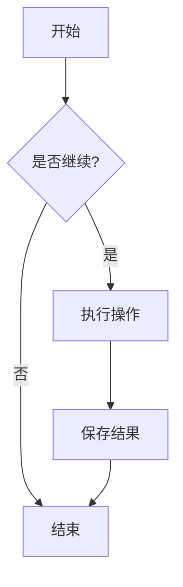
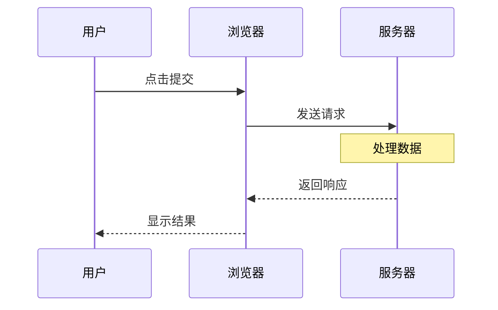
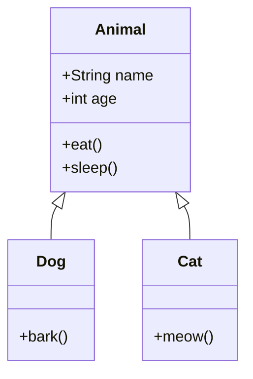
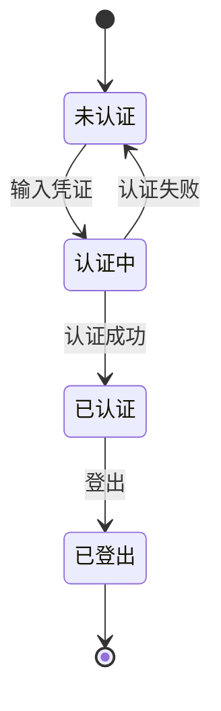
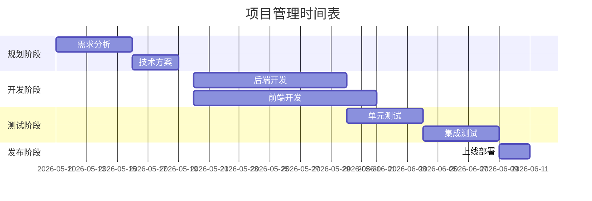
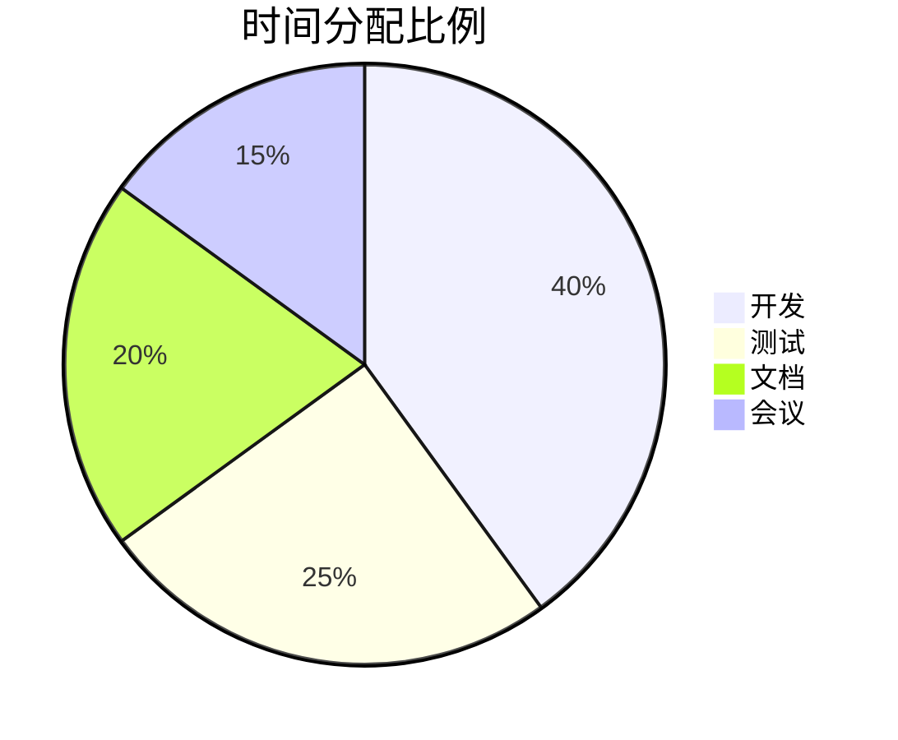
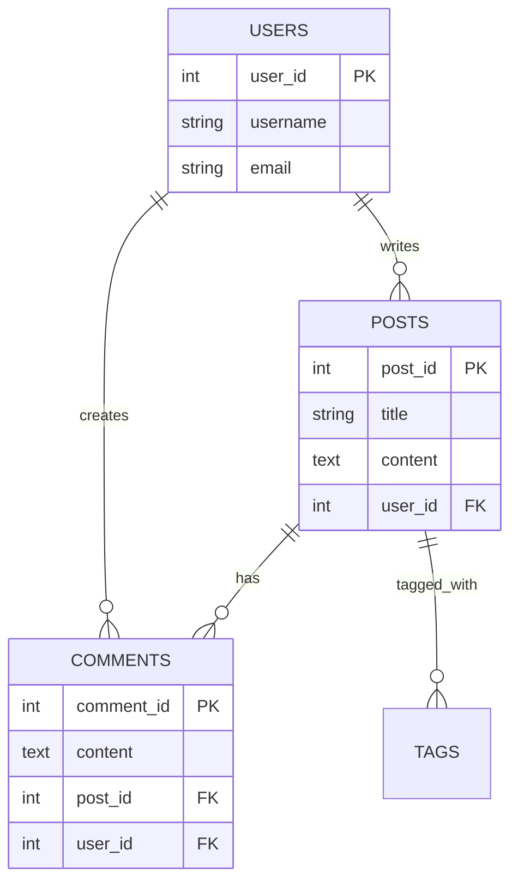
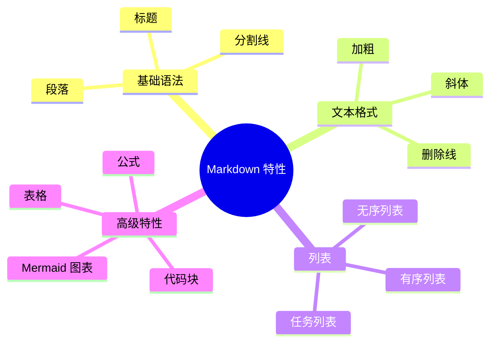
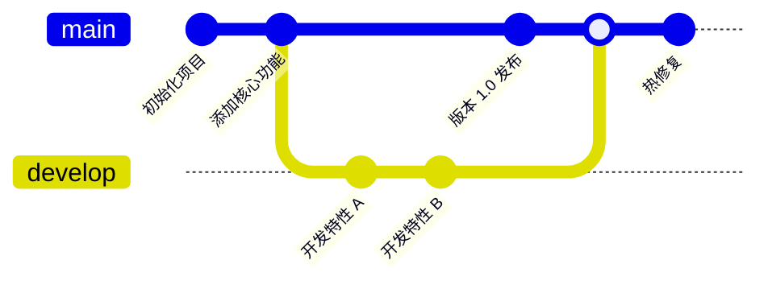

# Markdown 完全使用指南

> **Markdown** 是一种轻量级标记语言，用最小的格式化标记来实现丰富的文本表达。它简洁、易读、易写，是现代文档编写的首选工具。

---

## 目录
- [基础语法](#基础语法)
- [文本格式](#文本格式)
- [列表](#列表)
- [代码](#代码)
- [表格](#表格)
- [引用](#引用)
- [链接与图片](#链接与图片)
- [高级特性](#高级特性)
  - [数学公式](#数学公式)
  - [Mermaid 图表](#mermaid-图表)
  - [脚注](#脚注)
  - [HTML 元素](#html-元素)

---

## 基础语法

### 标题

Markdown 支持 6 级标题，使用 `#` 表示：

```markdown
# 一级标题
## 二级标题
### 三级标题
#### 四级标题
##### 五级标题
###### 六级标题
```

**效果预览：**

# 一级标题
## 二级标题
### 三级标题
#### 四级标题
##### 五级标题
###### 六级标题

---

### 分割线

使用三个或以上的 `-`、`*` 或 `_` 创建分割线：

```markdown
---
***
___
```

**效果：** 显示为一条水平线，常用于章节分隔。

---

## 文本格式

### 强调与修饰

| 效果 | 语法 | 示例 |
|------|------|------|
| **加粗** | `**文本**` 或 `__文本__` | **这是加粗文本** |
| *斜体* | `*文本*` 或 `_文本_` | *这是斜体文本* |
| ***加粗斜体*** | `***文本***` | ***加粗且斜体*** |
| ~~删除线~~ | `~~文本~~` | ~~已删除的文本~~ |
| `行内代码` | \`文本\` | `const x = 10;` |
| 上标 | `x<sup>2</sup>` | E=mc<sup>2</sup> |
| 下标 | `x<sub>2</sub>` | H<sub>2</sub>O |

### 文字颜色与背景

使用 HTML 标签实现更丰富的样式：

```html
<span style="color: red;">红色文字</span>
<span style="background-color: yellow; padding: 2px;">黄色背景</span>
<span style="color: white; background-color: blue; padding: 2px 4px;">蓝色背景白字</span>
```

**效果：** 
<span style="color: red;">红色文字</span>
<span style="background-color: yellow; padding: 2px;">黄色背景</span>
<span style="color: white; background-color: blue; padding: 2px 4px;">蓝色背景白字</span>

---

## 列表

### 无序列表

```markdown
- 项目 1
- 项目 2
  - 嵌套项目 2.1
  - 嵌套项目 2.2
- 项目 3
```

**效果：**
- 项目 1
- 项目 2
  - 嵌套项目 2.1
  - 嵌套项目 2.2
- 项目 3

### 有序列表

```markdown
1. 第一项
2. 第二项
   1. 嵌套第二项的第一个
   2. 嵌套第二项的第二个
3. 第三项
```

**效果：**
1. 第一项
2. 第二项
   1. 嵌套第二项的第一个
   2. 嵌套第二项的第二个
3. 第三项

### 任务列表

```markdown
- [x] 已完成的任务
- [ ] 未完成的任务
- [x] 审核代码
- [ ] 写测试用例
- [x] 发布版本
```

**效果：**
- [x] 已完成的任务
- [ ] 未完成的任务
- [x] 审核代码
- [ ] 写测试用例
- [x] 发布版本

---

## 代码

### 行内代码

使用反引号 `` ` `` 包装代码：

```markdown
使用 `console.log()` 方法打印内容
```

**效果：** 使用 `console.log()` 方法打印内容

### 代码块

使用三个反引号 ` ``` ` 创建代码块，可指定编程语言：

#### JavaScript

```javascript
// 函数定义
function greet(name) {
  return `Hello, ${name}!`;
}

// 箭头函数
const add = (a, b) => a + b;

console.log(greet('Markdown'));
console.log(add(5, 3));
```

#### Python

```python
def fibonacci(n):
    """生成斐波那契数列"""
    a, b = 0, 1
    for _ in range(n):
        yield a
        a, b = b, a + b

# 使用生成器
for num in fibonacci(10):
    print(num, end=' ')
```

#### HTML

```html
<!DOCTYPE html>
<html>
<head>
    <title>Hello Markdown</title>
</head>
<body>
    <h1>Welcome to Markdown</h1>
    <p>This is a paragraph.</p>
</body>
</html>
```

#### Shell/Bash

```bash
#!/bin/bash
# 这是一个简单的 Shell 脚本

echo "Starting backup..."
tar -czf backup_$(date +%Y%m%d).tar.gz /important/files
echo "Backup completed!"
```

#### SQL

```sql
SELECT user_id, username, COUNT(*) as post_count
FROM users
JOIN posts ON users.id = posts.user_id
WHERE created_at >= DATE_SUB(NOW(), INTERVAL 30 DAY)
GROUP BY user_id
ORDER BY post_count DESC
LIMIT 10;
```

---

## 表格

### 基础表格

```markdown
| 姓名 | 年龄 | 职位 | 部门 |
|------|------|------|------|
| 张三 | 28 | 工程师 | 技术部 |
| 李四 | 32 | 经理 | 产品部 |
| 王五 | 25 | 实习生 | 技术部 |
```

**效果：**

| 姓名 | 年龄 | 职位 | 部门 |
|------|------|------|------|
| 张三 | 28 | 工程师 | 技术部 |
| 李四 | 32 | 经理 | 产品部 |
| 王五 | 25 | 实习生 | 技术部 |

### 对齐表格

```markdown
| 左对齐 | 居中 | 右对齐 |
|:------|:----:|-------:|
| 左 | 中 | 右 |
| A | B | C |
```

**效果：**

| 左对齐 | 居中 | 右对齐 |
|:------|:----:|-------:|
| 左 | 中 | 右 |
| A | B | C |

### 复杂表格示例

| 功能 | 支持 | 优先级 | 备注 |
|------|:----:|:-----:|------|
| 用户认证 | ✓ | 高 | 已实现，支持 OAuth |
| 数据导出 | ✓ | 中 | 支持 CSV、JSON |
| 实时推送 | ✗ | 低 | 计划版本 2.0 |
| 数据加密 | ✓ | 高 | 使用 AES-256 |

---

## 引用

### 块引用

```markdown
> 这是一条引用。
>
> 可以包含多个段落。
>
> > 嵌套引用
```

**效果：**

> 这是一条引用。
>
> 可以包含多个段落。
>
> > 嵌套引用

### 引用与其他元素结合

```markdown
> **重要提示：**
> 
> - 这是一个重要的提示列表
> - 包含多个要点
> 
> ```
> // 引用中的代码
> const important = true;
> ```
```

**效果：**

> **重要提示：**
> 
> - 这是一个重要的提示列表
> - 包含多个要点
> 
> ```javascript
> // 引用中的代码
> const important = true;
> ```

---

## 链接与图片

### 链接

#### 标准链接

```markdown
[谷歌搜索](https://google.com)
[GitHub](https://github.com)
```

**效果：** [谷歌搜索](https://google.com)、[GitHub](https://github.com)

#### 带标题的链接

```markdown
[Llewellyn's Blog](https://old.llewellyn.top/blog/ "Llewellyn的博客")
```

**效果：** [Llewellyn's Blog](https://old.llewellyn.top/blog/ "Llewellyn的博客")

#### 自动链接

```markdown
<https://example.com>
<user@example.com>
```

**效果：** 
<https://example.com>
<user@example.com>

#### 引用式链接

```markdown
[1]: https://example.com
[官方网站][1]
[官方网站](https://example.com)
```

### 图片

#### 基础图片语法

```markdown


```

**效果：**


#### 图片调整大小（HTML）

```html

```

**效果：**


#### 图片与文本并排

```html


这是与图片并排的文本内容。可以用来写个人介绍或产品描述。
```

**效果：**


这是与图片并排的文本内容。可以用来写个人介绍或产品描述。

<div style="clear: both;"></div>

---

## 高级特性

### 数学公式（KaTeX）

#### 行内公式

```markdown
二次方程的解为 $x = \frac{-b \pm \sqrt{b^2-4ac}}{2a}$
```

**效果：**

二次方程的解为 $x = \frac{-b \pm \sqrt{b^2-4ac}}{2a}$

#### 块级公式

```markdown
$$
\begin{align}
E &= mc^2 \\
E &\text{ 是能量} \\
m &\text{ 是质量} \\
c &\text{ 是光速}
\end{align}
$$
```

**效果：**

$$
\begin{align}
E &= mc^2 \\
E &\text{ 是能量} \\
m &\text{ 是质量} \\
c &\text{ 是光速}
\end{align}
$$

~~这一块我也不是很懂，，，以后再来看看能不能填坑吧，，，~~

### 脚注

```markdown
这是一个带脚注的句子[^1]。

[^1]: 这是脚注的内容，会显示在文档末尾。
```

**效果：**

这是一个带脚注的句子[^1]。

[^1]: 这是脚注的内容，会显示在文档末尾。

### HTML 元素

Markdown 允许直接使用 HTML：

```html
<div style="background-color: #f0f0f0; padding: 15px; border-radius: 5px;">
  <h4>自定义框</h4>
  <p>这是一个使用 HTML 创建的自定义框。</p>
</div>
```

**效果：**

<div style="background-color: #f0f0f0; padding: 15px; border-radius: 5px;">
  <h4>自定义框</h4>
  <p>这是一个使用 HTML 创建的自定义框。</p>
</div>

### Mermaid 图表

Mermaid 是一个强大的图表库，可以用 Markdown 语法绘制各种专业图表。

#### 流程图（Flowchart）



#### 序列图（Sequence Diagram）



#### 类图（Class Diagram）



#### 状态图（State Diagram）



#### 甘特图（Gantt Chart）



#### 饼图（Pie Chart）



#### 关系图（Relationship Diagram）



#### 思维导图（Mindmap）



#### Git 图（Git Diagram）



### 逃转字符

如果需要显示 Markdown 特殊字符，使用反斜杠 `\` 逃转：

```markdown
\*这不是斜体\*
\[这不是链接\]
\# 这不是标题
```

**效果：**
\*这不是斜体\*
\[这不是链接\]
\# 这不是标题

---

## 最佳实践

### ✓ 建议做法

- [x] **一致性**：保持整个文档的格式风格一致
- [x] **清晰的层级**：合理使用标题划分内容结构
- [x] **代码高亮**：为代码块指定编程语言
- [x] **描述性链接**：使用有意义的链接文本而不是"点击这里"
- [x] **空行分隔**：用空行分隔不同的段落和部分

### ✗ 避免做法

- [ ] **过度格式化**：不要过度使用粗体、斜体或其他强调
- [ ] **深层嵌套**：避免超过 3 层的列表嵌套
- [ ] **混乱的结构**：标题层级应该逐步递进
- [ ] **不必要的 HTML**：仅在必要时使用原生 HTML
- [ ] **链接失效**：定期检查外部链接的有效性

---

## 常用 Markdown 编辑器

| 编辑器 | 平台 | 特点 |
|--------|------|------|
| VS Code | 跨平台 | 强大的扩展支持，集成 Git |
| Typora | 跨平台 | 所见即所得，美观简洁 |
| Obsidian | 跨平台 | 双向链接，知识管理 |
| Bear | macOS/iOS | 优雅的设计，专注写作 |
| MarkdownPad | Windows | 分屏预览，界面清晰 |

---

## 总结

Markdown 的强大之处在于它的**简洁性**和**可读性**。掌握本指南中的语法，你就能：

- 📝 快速编写格式化文档
- 🎨 创建美观的内容结构
- 🔄 轻松转换为其他格式（HTML、PDF 等）
- 💾 使用纯文本管理版本控制

开始使用 Markdown，让你的写作更高效吧！

---

**相关资源：**
- [CommonMark 规范](https://spec.commonmark.org/)
- [GFM 扩展](https://github.github.com/gfm/)
- [Markdown 教程](https://www.markdownguide.org/)

---

*最后更新于 2026 年 5 月 11 日*
